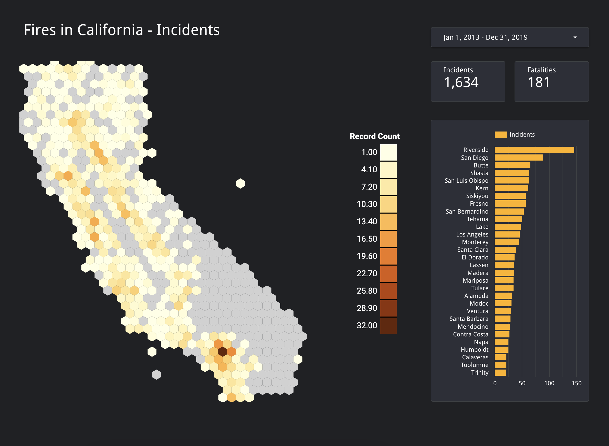

# Hexgrid Map
Data Studio Community Visualization for displaying hexgrid maps.

See it in use [here](https://datastudio.google.com/reporting/c66c9909-ae0b-4a19-a7ba-296e04e5a0f3).



## First-time Setup
The main things you'll need to do are: install the dependencies, download the maps, bundle the JS code. This can be done by running the following commands:

```
npm install
npm run map
npm run build
```

In order to upload the result to your cloud storage bucket, make sure to set it up in your `package.json` config.
```
  ...
  "config": {
    "gcsLocation": "gs://<YOUR-BUCKET-HERE>",
    ...
  }
  ...
```

You can then upload your visualization by running `npm run upload`.

## Usage
In order to use it in Data Studio, follow the instructions [here](https://codelabs.developers.google.com/codelabs/community-visualization/#10). You'll have to create a report, add a community visualization, select "Build your own" and then enter the location fo your manifest file in cloud storage.

## Development
- During normal development you only need to run `npm run build` to re-bundle the JS code.
- If you want to see the updates in your visualization you'll need to update your code in cloud storage with `npm run update`.

## Adding maps
By default, only the us map is set to be downloaded.

You can include additonal maps by adding file names from [this repository](https://github.com/codeforgermany/click_that_hood/tree/main/public/data) from which they are downloaded to the `package.json` config as seen below:

```
  ...
  "config": {
    ...
    "maps": "united-states europe asia africa"
  }
  ...
```

Once you've added your maps to the config, you can run `npm run map` to download the new maps. They will then be included into the bundled JS the next time you run the build command.

In order to make these new maps selectable from your report you also will need to change `src/hexgrid-map.json` as seen below:

```
          {
            "type": "SELECT_SINGLE",
            "id": "map",
            "label": "Map",
            "defaultValue": "united-states",
            "options": [
              {
                "label": "United States",
                "value": "united-states"
              },
              {
                "label": "Europe",
                "value": "europe"
              },
              {
                "label": "Asia",
                "value": "asia"
              },
              {
                "label": "Africa",
                "value": "africa"
              },
            ]
          },
```
